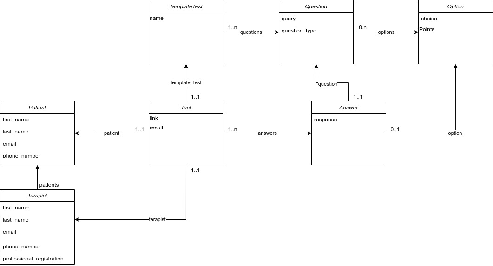

# PsychoKiller

This Readme is in Work In Progress

# Links

[- Links](#Introduction)


[- Getting Started - Backend](#Getting-Started-Back )

[ Prerequisites ](#Prerequisites-Back)
[|| Setup ](#Setup-Back)
[|| Migrations ](#Migrations-Back)
[|| Running ](#Running-Back)


[- Getting started-Frontend _skip this section for now_](#Getting-started-Frontend)

[ Prerequisites ](#Prerequisites-Front)
[|| Setup ](#Setup-Front)
[|| Migrations ](#Migrations-Front)
[|| Running ](#Running-Front)

[- Contributing](#Contributing)

[- Branches](#Branches)

[- Commits](#Commits)

[- PRs](#PRs)

[- Docs](#Docs)

[- Model](#Model)

[- LoadData](#LoadData)


[- Others](#Others)

## Introduction

PsychoKiller is a tool that provides a way to manage and carry out psychology tests

It is developed as a web app using [Django](https://www.djangoproject.com/) as a backend framework and [React](https://reactjs.org/) to build the UI

## Getting-started-Backend

### Prerequisites-Back

- [Python 3](https://www.python.org/)

- [python3-venv](https://docs.python.org/3/library/venv.html)

- [Pip3](https://pypi.org/project/pip/)

- DB to be defined

### Setup-Back

1. Go to Django folder, run: `bash cd back`

2. Install virtualenv `bash pip3 install virtualenv`

3. Activate virtualenv, if you're in linux and using bash/zsh : `bash source venv/bin/activate` if not check [here](https://docs.python.org/3/library/venv.html)

4. Install backend dependencies, run: `bash pip3 install -r requirements.txt`

5. Optional: We have a recommended vscode setting file in `.vscode/recommended.settings.json`, we **strongy** suggest you to use that configuration, you only have to rename the file from `recommended.settings.json` to `settings.json`

6. Run migrations

### Migrations-Back

You should run these commands the first time you set up the repo and every time that you change the model

1. Create migrations: `bash python3 manage.py makemigrations psychoApp`

2. Run migrations: `bash python3 manage.py migrate`

3. Create a superuser to have access to the [Administrative Interface](https://docs.djangoproject.com/en/3.1/ref/contrib/admin/) running `bash python manage.py createsuperuser` and follow instructions

### Running-Back

1. Go to Django folder, run: `bash cd back`

2. Activate virtualenv if you're in linux and using bash/zsh : `bash source venv/bin/activate` if not check [here](https://docs.python.org/3/library/venv.html)

3. To start the Django server run: `bash python3 manage.py runserver`

### Useful commands

#### Autofromatter

We use `Black` as autoformatter

1. Go to backend root folder
2. Run `bash black ./path-to-file` or `bash black ./back` to run in every file in the project

#### Linter

We use `Flake8` as linter

1. Run `bash flake8 ./path-to-file` or `bash flake8 ./back` to run in every file in the project

## Getting-started-Frontend _skip this section for now_

### Prerequisites-Front

- [Node](https://nodejs.org)

- [NPM](https://www.npmjs.com/)

### Setup-Front

1. Run: `bash cd front/psycho_front`

2. Run: `bash yarn install`

### Running-Front

## Contributing

```
Como manejarse con Git:
    -En rama development se manejan los cambios, cada dev tendrá una rama de la cual trabajar, al iniciar
       la mergea con development, trabaja, una vez termina su trabajo pushea su rama, y cuando confirme que es código funcional se mergea a development
       Ej: git checkout mi_rama , git merge development (work) git add, git commit, git push mi_rama, git checkout development, git push development.

    -La rama main se va a actualizar mediante push request desde la rama development, ninguna otra rama se conecta con main.
```

### Branches

Please name your branches as follows `type_of_branch/developer_name/branch_description`

**type_of_branch possible values**

- `feature` - A feature branch
- `bugfix` - A bugfix branch
- `chore` - Changes to the build process or auxiliary tools and libraries
- `doc` - Documentation related changes
- `refactor` - A code change that neither fixes a bug nor adds a feature

### Commits

No conventions required when commiting to a branch as they will be squashed one PR is Merged, but for commmits done directly to the development branch the message should be like this:

```
type_of_commit: Main Message

Optional Description
```

`type_of_commit` possible values same as `type_of_branch`

### PRs

Please title PR as

`type_of_branch: Main Description`

Add optional Message to the body of the PR

Once approved please squash PR, title and message should follow same convention as PR.

## Docs

### Model

[Updated draw io Model](https://drive.google.com/file/d/10hqU88j-wviGUm4WkoZvQdNqPKNEO4dV/view?usp=sharing)



### LoadData

Provide the DB with actual data when you first migrate it
    The information is get it from "psychoApp/fixtures/..", is in JSON format

    Example, load the SCL90 test template, and their questions:
```
    python manage.py loaddate --format json SCL90__template_test
    python manage.py loaddata --format json SCL90__questions
``` 
    Observation: Be careful with the dependences i the db, in this case
    the questions of SCL90 have like Foregin_key the  SCL90 template_test PK
    Thats why template_test is load first.

## Other

```
In work...
```
